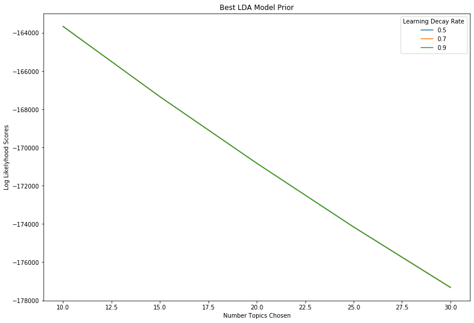
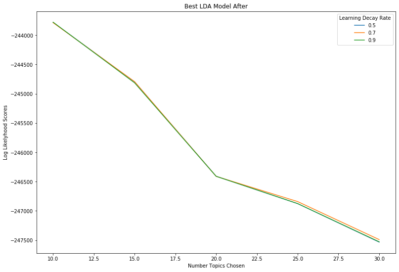

# Trump's Discourse Before and After the 2018 Midterm Election

## Introduction

The 2016 presidential election is one of the most contentious elections in American history. A political outsider, despite losing the popular vote, manage to overcome his establishment counterpart. This victory brought success across the board for the GOP party, with a large majority in both the House and the Senate. It also allowed them the ability to secure two supreme court nominations. With this success, Trump has now become the symbol of the party, meaning that the public's perception of him directly reflects the public's perception of the Republican party.

The midterms of 2018 reveal this fact clearer than ever, with a sharp swing to the democrats in the house of representatives. In figure I below, the vote counts for every congressional district are shown, as well as which party won the district and if the district's representative endorsed trump in 2016. The first year 2014 is shown to give a comparison to how different the 2018 midterm elections were in comparison to years past. If play it hit on the graphic, or the year scroll bar is used, a depression can clearly be seen in the change between 2016 to 2018 of the republicans that endorsed trump. While not highlighted specifically, most of the maroon dots that are now cleary among democratic districts represent the several endorsers who lost their seat in the election. 

##### Figure I

<iframe width="750" height="500" frameborder="0" scrolling="no" src="//plot.ly/~cad162/1.embed"></iframe>

These results bring up an interesting question, given how tied the GOP party is to the current president, of how much of Trump's discourse is affecting the party. In traditional election years, the president will go out and help campaign in the midterm elections to help support his/her party, and Trump is no different. The difference comes in his unfiltered approach to political speeches, seemingly unafraid of saying anything on his mind or attacking anyone he pleases. In this analyses, the different speech topics and words chosen will be analyzed both before and after the midterm election to see the topic's Trump most used in the midterms and if he has changed after the midterm loss.

## Methodology

In order to analyze the discourse in a non subjective way, a machine learning approach called topic modeling will be used. Topic modeling is a sub-branch of machine learning called natural language processing, which attempts to use textual information as data in computer models rather than numbers. The topic model that will be used is called Latent Dirichlet allocation (LDA), which is an unsupervised learning technique, where the only real parameter about the results is the number of topics the model will find. In this model, after specifying the number of topics and the text to use, the computer will analyze the frequency of terms that are used in the text and output topics based off the uniqueness of the combination of terms. The output, in the case of Trump's discourse, will be a list of topics that are most frequently used, along with the weights of which words were most important to each topic. After seeing the words used, and their weights, it will be easy then to infer what subject matter is present in each topic computed, allowing us to see strategies used by the president leading up to and after the midterm election.

The analyses will use 10 speeches that happened in the month prior to the election and 10 speeches in the month after the election as two different corpuses of text. Each speech is broken down into 100-150 speech chunks, with each chunk being defined by uninterrupted speech by the president. This means that each time he takes a break to breath, reads the crowd, or waits for applause/noise to die down, would create a new speech chunk. All 10 speeches are then combined together and pre-processed according to best practices to be able to use them in a NLP model. This includes removing stop words, (such as like, the, him, her, had) returning words to their base (e.g. running/ran to run), filtering out numbers and symbols, and weighting the corpus of text by the frequency of the words occurring. After all these processes are run on the corpus of text, the text is ready to be used in NLP modeling.

 #### Parameter Searching
 
The next step after the text has been cleaned and is ready to use is to search for the best parameter, which in this case will be number of topics. Now any number could be used and wouldn’t necessarily be wrong, but any number chosen is somewhat subjective, so in order to add more validity to the process a grid search will be performed on the model. A grid search essentially searches through multiple permutations of parameters and picks the model with the best log likelihood. Log likelihood in the context of this search, means that the higher the number is the more likely the parameters used in that model create data that is representative of reality. The grid search runs a topic model for each type of parameter and compares the log likelihoods to choose the best model to use. 

Figure II and Figure III are the log likelihood graphs from the grid search which show the results. For both models it can be seen 10 topics have the highest loglikelihood scores, so that is the parameter that will be chosen for the comparison analyses. Another aspect shown hear is learning rate, which does not matter in this instance because there is almost no difference in log likelihood between the different learning rates. The learning rate, which is defined by how fast a machine learning model adapts to its model, remains the same as all the lines essentially overlap each other on the graph.
##### Figure II

##### Figure III

